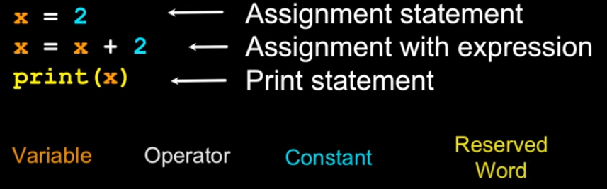
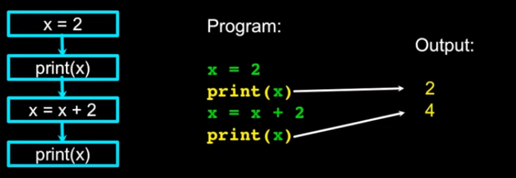
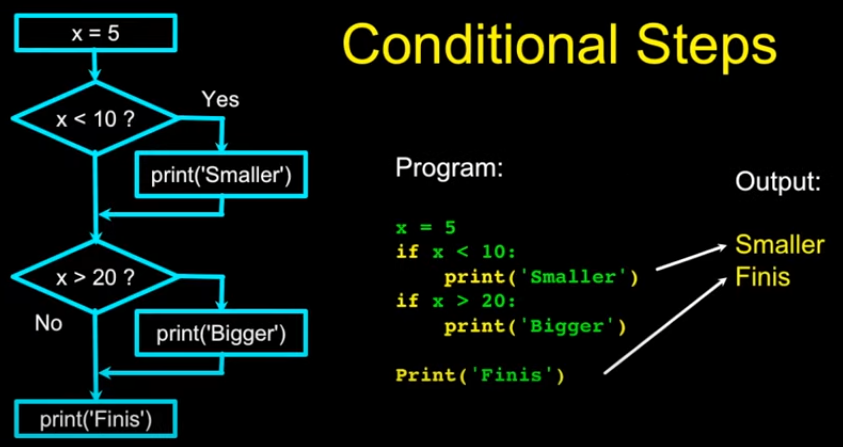

# Python-Learning

## Scientific Computing with Python:
### Python for everybody

- Central Processing Unit: Runs the Program - The CPU is always wondering "what to do next". Not the brains exactly - very dumb but very very fast
- Input devices: Keyboard, Mouse, Touch Screen
- Output devices: Screen, Speakers, Printer, DVD Burner
- Main Memory: Fast small temporary storage - lost on reboot - aka RAM
- Secondary Memory: Slower large permanent storage - lasts until deleted - disk drive / memory stick

You cannot use reserved words as variable names / identifiers:

Sentences or Lines:

###Program Steps or Program Flow

- A program is a **sequence** of steps to be done in order.
- Some steps are **conditional** - they may be skipped.
- Sometimes a step or group of steps is to be **repeated**
- Sometimes we store a set of steps to be used over and over as needed several places throughout the program.

Sequential steps:

When a program is running, it flows from one step to the next. As programmers, we set up "paths" for the program to follow.

Conditional steps:

